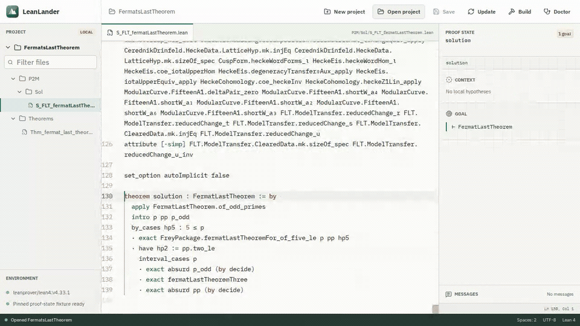
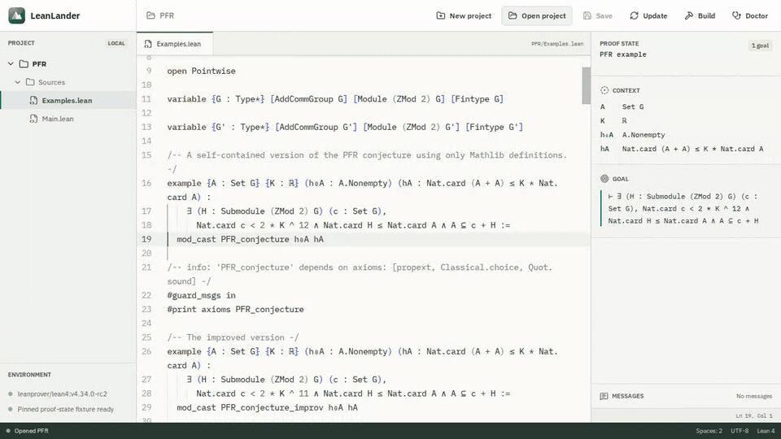
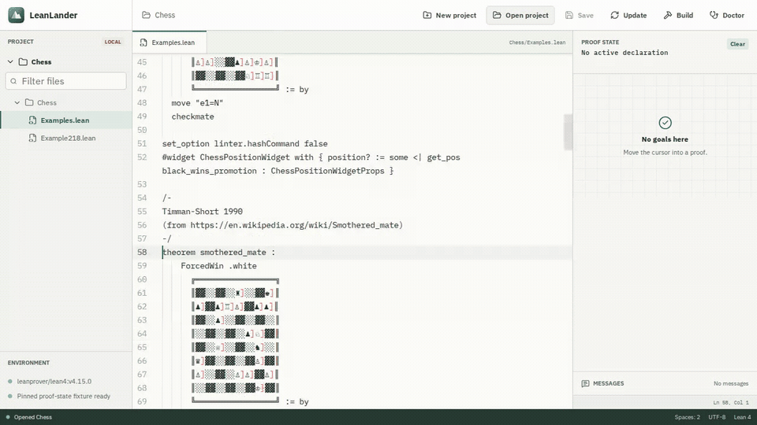
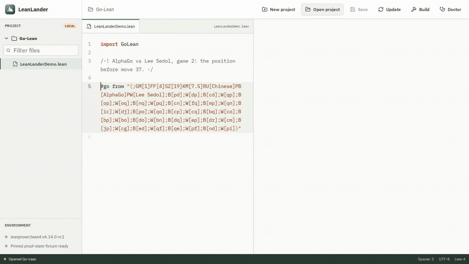

<p align="center">
  
</p>

<h1 align="center">LeanLander</h1>

<p align="center"><strong>There can be only one... Lean IDE.</strong></p>

<p align="center">
  <a href="https://github.com/JGalego/LeanLander/releases/tag/v0.2.0"></a>
  
  
  <a href="https://github.com/JGalego/LeanLander/actions/workflows/ci.yml"></a>
  <a href="LICENSE"></a>
</p>

LeanLander is a focused, cross-platform desktop IDE for Lean 4. It aims to make opening a project and proving feel immediate, without asking users to become experts in Elan, Lake, or editor configuration first.

**LeanLander v0.2.0 is being prepared** with Unicode abbreviation input, multiple proof goals, readable messages, event-driven Lean updates, lazy project loading, reusable document sessions, and automatic light/dark appearance.

## Proof Corpus Walkthroughs

<table>
  <tr>
    <td width="50%">
      <a href="docs/demos.md#openai-navier-stokes-and-euler">
        
      </a>
      <br><strong>OpenAI: Navier-Stokes and Euler</strong>
    </td>
    <td width="50%">
      <a href="docs/demos.md#anthropic-fermats-last-theorem">
        
      </a>
      <br><strong>Anthropic: Fermat's Last Theorem</strong>
    </td>
  </tr>
  <tr>
    <td width="50%">
      <a href="docs/demos.md#pfr-community-project">
        
      </a>
      <br><strong>PFR Community Project</strong>
    </td>
    <td width="50%">
      <a href="docs/demos.md#chesslean">
        
      </a>
      <br><strong>Chess.lean</strong>
    </td>
  </tr>
  <tr>
    <td colspan="2" align="center">
      <a href="docs/demos.md#go-lean-proofwidgets">
        
      </a>
      <br><strong>Go-Lean: AlphaGo's move 37</strong>
    </td>
  </tr>
</table>

Reproducible scripted sessions navigate pinned source from OpenAI's Navier-Stokes and Euler project, Anthropic's Fermat's Last Theorem project, the PFR community formalization, and Chess.lean. A fifth session loads Go-Lean's real ProofWidget and recreates AlphaGo's famous move 37 against Lee Sedol through its RPC-backed board. See [docs/demos.md](docs/demos.md) for exact commits, integrity checks, attribution, and the distinction between deterministic fixtures and live upstream builds.

## Installation

LeanLander is distributed only through GitHub Releases and the commands below, not through app stores or operating-system package repositories. Download v0.2.0 from the [latest release](https://github.com/JGalego/LeanLander/releases/latest) and verify it against [SHA256SUMS.txt](https://github.com/JGalego/LeanLander/releases/latest/download/SHA256SUMS.txt). These community builds are not code-signed or notarized, so macOS or Windows may show an unidentified-developer warning.

### Linux 🐧

On Debian or Ubuntu x86_64, download and install the Debian package:

```bash
curl --fail --location --output /tmp/LeanLander_0.2.0_linux_amd64.deb https://github.com/JGalego/LeanLander/releases/latest/download/LeanLander_0.2.0_linux_amd64.deb && sudo apt install /tmp/LeanLander_0.2.0_linux_amd64.deb
```

Other x86_64 distributions can use the [AppImage](https://github.com/JGalego/LeanLander/releases/latest/download/LeanLander_0.2.0_linux_amd64.AppImage).

### macOS 🍎

This command selects the Apple Silicon or Intel disk image and opens it. Drag LeanLander into Applications when Finder appears.

```bash
case "$(uname -m)" in arm64) asset="LeanLander_0.2.0_darwin_aarch64.dmg" ;; x86_64) asset="LeanLander_0.2.0_darwin_x64.dmg" ;; *) echo "Unsupported macOS architecture" >&2; exit 1 ;; esac && curl --fail --location --output "/tmp/$asset" "https://github.com/JGalego/LeanLander/releases/latest/download/$asset" && open "/tmp/$asset"
```

### Windows 🪟

From PowerShell on x64 Windows, download and launch the installer:

```powershell
$installer = Join-Path $env:TEMP 'LeanLander_0.2.0_windows_x64-setup.exe'; Invoke-WebRequest -Uri 'https://github.com/JGalego/LeanLander/releases/latest/download/LeanLander_0.2.0_windows_x64-setup.exe' -OutFile $installer; Start-Process -FilePath $installer
```

## Development

All platforms require [Node.js](https://nodejs.org/) `^20.19.0` or `>=22.12.0`, npm, and [Rust via rustup](https://www.rust-lang.org/tools/install). Clone the repository and install the locked JavaScript dependencies:

```bash
git clone https://github.com/JGalego/LeanLander.git
cd LeanLander
npm ci
```

On Debian or Ubuntu, install Tauri's native libraries and start LeanLander:

```bash
sudo apt update && sudo apt install -y libwebkit2gtk-4.1-dev build-essential curl wget file libxdo-dev libssl-dev libayatana-appindicator3-dev librsvg2-dev && npm run tauri dev
```

For other Linux distributions, use the equivalent packages from the [Tauri prerequisites](https://v2.tauri.app/start/prerequisites/). On macOS, install Xcode, complete its first-launch setup, and run `xcode-select -p >/dev/null && npm run tauri dev`. On Windows, install Microsoft C++ Build Tools with **Desktop development with C++**, ensure WebView2 is available, and run `npm run tauri dev` from PowerShell.

For a frontend-only preview on any platform, run `npm run dev` and open `http://localhost:1420`. The sample workspace works in a browser, but native folder selection and Lean server features do not.

Build an installable desktop bundle with `npm run tauri build`.

## Quality Checks

```bash
npm run check
npm run e2e
npm run profile
cargo fmt --manifest-path src-tauri/Cargo.toml --check
cargo check --manifest-path src-tauri/Cargo.toml
```

`npm run check` runs Oxlint, Vitest, TypeScript, and the Vite production build. Install Chromium once with `npm run e2e:install`; `npm run e2e` exercises temporary-project, keyboard, accessibility, and performance workflows. `npm run profile` emits the focused Chromium profile described in [docs/releasing.md](docs/releasing.md). `cargo check` requires the platform dependencies listed above.

## Structure

```text
src/
  components/       React workspace and editor panels
  editor/           Monaco and Lean language setup
  model/            UI-facing workspace and proof-state data
  services/         Frontend service boundaries
  test/             Shared frontend test setup
src-tauri/
  capabilities/     Tauri permission policy
  src/              Native application entry points
docs/
  architecture.md   System boundaries and integration strategy
  demos.md          Pinned proof-corpus walkthroughs and attribution
  releasing.md      Release process and performance baseline
  roadmap.md        Milestone status and next work
```

See [docs/architecture.md](docs/architecture.md) for design decisions, [docs/demos.md](docs/demos.md) for proof-corpus recordings, [docs/releasing.md](docs/releasing.md) for distribution details, and [docs/roadmap.md](docs/roadmap.md) for the implementation sequence.
