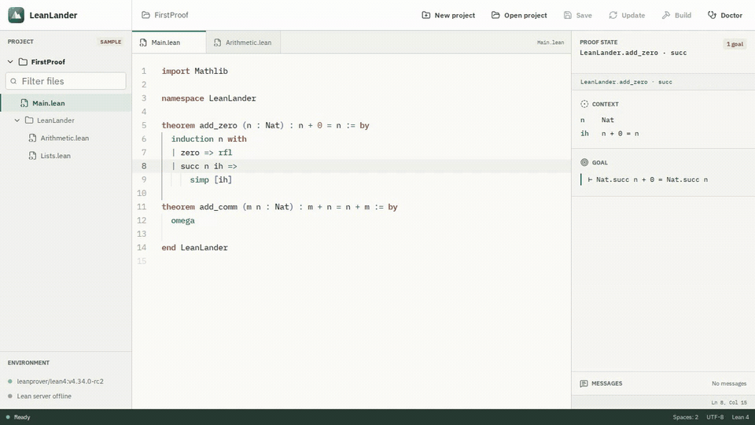

<p align="center">
  
</p>

<h1 align="center">LeanLander</h1>

<p align="center"><strong>There can be only one... Lean IDE.</strong></p>

<p align="center">
  
  
  
  <a href="https://github.com/JGalego/LeanLander/actions/workflows/ci.yml"></a>
  <a href="LICENSE"></a>
</p>

LeanLander is a focused, cross-platform desktop IDE for Lean 4. It aims to make opening a project and proving feel immediate, without asking users to become experts in Elan, Lake, or editor configuration first.

The project has completed **Milestone 7**: LeanLander provides cross-platform installer builds, version-tagged releases with checksums, temporary-project browser workflows, WCAG A/AA automation, and reproducible startup and editor-memory profiling. Lean Doctor reports Elan, toolchain, Lean, Lake, dependency, and server health, offers only explicit managed repairs, and keeps bounded process details hidden until requested. LeanLander can also create Lean or Mathlib Lake projects, optionally initialize Git, update dependencies, and run builds with progress, cancellation, and actionable failure messages. Real projects use one managed Lean server per workspace for document synchronization, diagnostics, language features, and cursor-position proof states. The bundled sample remains deterministic and works without native tools.

## Proof Corpus Walkthroughs

[](docs/demos.md)

Reproducible scripted sessions navigate pinned source from OpenAI's Navier-Stokes and Euler project, Anthropic's Fermat's Last Theorem project, and the PFR community formalization. See [docs/demos.md](docs/demos.md) for all recordings, exact commits, integrity checks, attribution, and the distinction between deterministic proof-state fixtures and live upstream builds.

## Getting Started

Start from a local clone of this repository. All platforms require [Node.js](https://nodejs.org/) `^20.19.0` or `>=22.12.0`, npm, and [Rust via rustup](https://www.rust-lang.org/tools/install).

### Linux 🐧

On Debian or Ubuntu, this one command installs Tauri's native libraries, installs the locked JavaScript dependencies, and starts LeanLander:

```bash
sudo apt update && sudo apt install -y libwebkit2gtk-4.1-dev build-essential curl wget file libxdo-dev libssl-dev libayatana-appindicator3-dev librsvg2-dev && npm ci && npm run tauri dev
```

For other distributions, use the equivalent packages from the [Tauri prerequisites](https://v2.tauri.app/start/prerequisites/).

### macOS 🍎

Install Xcode and complete its first-launch setup, then run:

```bash
xcode-select -p >/dev/null && npm ci && npm run tauri dev
```

### Windows 🪟

Install Microsoft C++ Build Tools with **Desktop development with C++** and ensure WebView2 is available. From PowerShell, run:

```powershell
npm ci; if ($LASTEXITCODE -eq 0) { npm run tauri dev }
```

For a frontend-only preview on any platform, run `npm run dev` and open `http://localhost:1420`. The sample workspace works in a browser, but native folder selection and Lean server features do not.

Build an installable desktop bundle with `npm run tauri build`.

## Quality Checks

```bash
npm run check
npm run e2e
npm run profile
cargo fmt --manifest-path src-tauri/Cargo.toml --check
cargo check --manifest-path src-tauri/Cargo.toml
```

`npm run check` runs Oxlint, Vitest, TypeScript, and the Vite production build. Install Chromium once with `npm run e2e:install`; `npm run e2e` exercises temporary-project, keyboard, accessibility, and performance workflows. `npm run profile` emits the focused Chromium profile described in [docs/releasing.md](docs/releasing.md). `cargo check` requires the platform dependencies listed above.

## Structure

```text
src/
  components/       React workspace and editor panels
  editor/           Monaco and Lean language setup
  model/            UI-facing workspace and proof-state data
  services/         Frontend service boundaries
  test/             Shared frontend test setup
src-tauri/
  capabilities/     Tauri permission policy
  src/              Native application entry points
docs/
  architecture.md   System boundaries and integration strategy
  demos.md          Pinned proof-corpus walkthroughs and attribution
  releasing.md      Release signing and performance baseline
  roadmap.md        Milestone status and next work
```

See [docs/architecture.md](docs/architecture.md) for design decisions, [docs/demos.md](docs/demos.md) for proof-corpus recordings, [docs/releasing.md](docs/releasing.md) for distribution details, and [docs/roadmap.md](docs/roadmap.md) for the implementation sequence.
