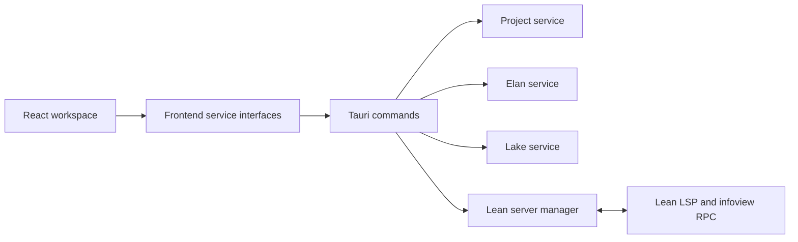

# LeanLander Architecture

## Direction

LeanLander is an orchestration layer around Lean's existing ecosystem. React owns presentation, Rust owns trusted operating-system and process work, and Lean, Elan, and Lake retain authority over language semantics, toolchains, and packages.

No UI component should construct a shell command. Native operations accept structured input, validate it, and use Rust process APIs with explicit executable and argument arrays.

## Current Boundary

Milestone 2 adds narrowly scoped Rust commands for project discovery, source loading and saving, and recent-project history. `ProjectGateway` still isolates the native folder dialog, while `ProjectClient` owns structured `invoke` calls. Browser mode keeps the deterministic sample workspace active.

Project discovery performs one bounded scan, ignores generated and dependency directories, and never follows symlinks. Later reads and writes accept only existing relative `.lean` paths whose canonical targets remain inside the selected project. Recent paths are stored in Tauri's application data directory.

The Tauri capability grants `dialog:allow-open` only. Filesystem access remains behind validated Rust commands; there is no shell plugin, broad filesystem scope, or process capability exposed to the webview. Monaco and both fonts are packaged locally, so the editor does not fetch runtime assets from a CDN.

The proof panel still consumes fixture data selected by cursor line. This proves the editor-to-infoview interaction shape without pretending a Lean server is connected.

## Planned Native Services

### Project service

Project discovery will inspect a selected directory for `lean-toolchain`, `lakefile.toml`, `lakefile.lean`, and Lean sources. It will return structured facts and warnings before offering any modifying action. LeanLander will not introduce a proprietary project format.

### Toolchain service

The toolchain service will discover Elan through platform-aware locations, parse `lean-toolchain`, list installed toolchains, and invoke Elan with explicit arguments. Installation and removal will require a user action and report progress as structured events.

### Lake and build service

Lake remains the package and build authority. LeanLander will invoke known Lake operations directly, capture stdout and stderr separately, and translate common failures into actionable messages. Arbitrary project-provided commands will not run silently.

### Lean server manager

One long-lived server process will be owned per open workspace. The manager will launch the project-selected Lean server, speak JSON-RPC over stdio, route document lifecycle events, and stop the process when its workspace closes. Restarts will be bounded and observable rather than implemented as aggressive polling.

Diagnostics, hover, completion, definitions, references, and symbols will use standard LSP messages. Proof state will reuse Lean's existing infoview and RPC mechanisms. The upstream `@leanprover/infoview` loader is designed for LSP-capable hosts that can mirror notifications and relay requests; Milestone 4 will verify and isolate the compatibility layer rather than inventing a second proof protocol.

## Process And Error Model

Native process results will keep two representations:

- A user-facing category, summary, and suggested recovery action.
- A debug record containing executable, argument array, selected non-secret environment, exit status, stdout, stderr, and elapsed time.

Secrets and unrelated environment values will not be logged. Cancellation will terminate the owned child process and descendants using platform-specific implementations behind one interface.

## Cross-Platform Strategy

- Use `std::path::PathBuf` and native path APIs; never split filesystem paths in Rust as strings.
- Use `std::process::Command` or an async equivalent with separate arguments; never interpolate project paths into a shell command.
- Keep executable discovery, process-tree termination, and installer behavior behind platform modules.
- Store application state in Tauri-provided app-data locations.
- Test spaces, Unicode, Windows separators, and missing executables explicitly.

## Version Compatibility

The project toolchain file selects Lean. Server startup and RPC compatibility will be represented as capabilities detected from the selected version, not assumptions embedded in React components. Version-specific adapters belong next to the Lean server manager and expose one stable application interface.

## Testing Layers

Frontend unit tests cover service boundaries, workspace transitions, error/loading states, and proof rendering. Rust unit tests will cover project detection, executable discovery, command construction, and output parsing as those services arrive. Integration tests will use temporary projects and opt-in downloaded toolchains so the default unit suite remains fast and offline.