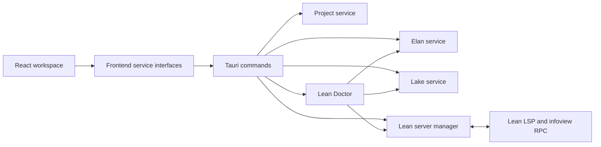

# LeanLander Architecture

## Direction

LeanLander is an orchestration layer around Lean's existing ecosystem. React owns presentation, Rust owns trusted operating-system and process work, and Lean, Elan, and Lake retain authority over language semantics, toolchains, and packages.

No UI component should construct a shell command. Native operations accept structured input, validate it, and use Rust process APIs with explicit executable and argument arrays.

## Current Boundary

Narrowly scoped Rust commands own project discovery, source loading and saving, recent-project history, Elan and Lake operations, Lean server communication, and environment diagnosis. Frontend clients own structured `invoke` calls, while `ProjectGateway` isolates native folder dialogs. Browser mode keeps the deterministic sample workspace active without claiming native services are available.

Project discovery performs one bounded scan, ignores generated and dependency directories, and never follows symlinks. Later reads and writes accept only existing relative `.lean` paths whose canonical targets remain inside the selected project. Recent paths are stored in Tauri's application data directory.

The Tauri capability grants `dialog:allow-open` only. Filesystem access remains behind validated Rust commands; there is no shell plugin, broad filesystem scope, or process capability exposed to the webview. Monaco and both fonts are packaged locally, so the editor does not fetch runtime assets from a CDN.

For a real project, Monaco documents are synchronized with a managed Lean process using full-text, monotonically versioned LSP updates. Diagnostics become Monaco markers, and hover, completion, definition, references, and document symbols use Monaco providers backed by standard LSP requests. The proof panel uses Lean's infoview RPC at the current cursor position. Only the bundled sample uses fixture proof data.

## Native Services

### Project service

Project discovery inspects a selected directory for `lean-toolchain`, `lakefile.toml`, `lakefile.lean`, and Lean sources. It returns structured facts and warnings before offering any modifying action. LeanLander does not introduce a proprietary project format.

### Toolchain service

The toolchain service discovers Elan through `ELAN_HOME`, platform-aware default locations, and finally `PATH`. It parses installed and active toolchains independently because an active default may not be installed yet. Project-required installations require an explicit user action, invoke Elan with a validated argument array, expose structured progress, and retain a managed child-process handle for cancellation.

When Elan is absent, LeanLander presents manual installation guidance rather than downloading and executing a script. Browser previews report native tools as unavailable instead of implying that a background check is pending.

### Lake and build service

Lake remains the package and build authority. LeanLander creates the CLI-supported `std` and `math` templates, optionally initializes Git, and runs dependency updates and builds through the project-selected toolchain. Each operation has one owned child process, bounded output capture, structured progress, and operation-scoped cancellation so a late cancellation cannot replace a successful result. Network, dependency, build, Git, process, and configuration failures become actionable messages. Arbitrary project-provided commands do not run silently.

### Lean server manager

One long-lived server process is owned per open workspace. The manager launches the project-selected Lean server through Elan, speaks framed JSON-RPC over stdio, routes document lifecycle events, answers server-to-client configuration requests, caches diagnostics by URI, and stops the process when its workspace closes.

Diagnostics, hover, completion, definitions, references, and symbols use standard LSP messages. Proof state connects to Lean's existing infoview session and calls `Lean.Widget.getInteractiveGoals`; a native compatibility adapter strips rich RPC tags into the stable UI model and falls back to `$/lean/plainGoal` when interactive RPC is unavailable.

### Lean Doctor

Lean Doctor is a read-only aggregator over the project, Elan, Lake, and server services. Its summary checks Elan discovery, the selected toolchain, bounded Lean and Lake version probes, the Lake manifest and latest dependency operation, and the managed server state. It does not install, update, build, or restart anything while diagnosing.

Repairs are explicit and allowlisted. Runnable actions delegate to the existing managed toolchain installation, Lake update, or server restart flows; manual repairs provide guidance without executing shell text. Detailed environment facts and bounded Lake or server output use a separate command and are not requested until the user opens the details disclosure.

## Process And Error Model

Native process results keep two representations:

- A user-facing category, summary, and suggested recovery action.
- A debug record containing executable, argument array, selected non-secret environment, exit status, stdout, stderr, and elapsed time.

Secrets and unrelated environment values are not collected. Diagnostic details include local project paths and therefore remain hidden by default with an in-product sharing warning. Cancellation terminates the owned child process through the service that started it.

## Cross-Platform Strategy

- Use `std::path::PathBuf` and native path APIs; never split filesystem paths in Rust as strings.
- Use `std::process::Command` or an async equivalent with separate arguments; never interpolate project paths into a shell command.
- Keep executable discovery, process-tree termination, and installer behavior behind platform modules.
- Store application state in Tauri-provided app-data locations.
- Test spaces, Unicode, Windows separators, and missing executables explicitly.

## Version Compatibility

The project toolchain file selects Lean. Server capabilities are captured from the initialize response rather than assumed in React components. A compatibility adapter next to the server manager owns proof RPC decoding and fallback behavior behind one stable application interface. The live integration test has been exercised against Lean 4.14 and 4.33.

## Testing Layers

Frontend unit tests cover service boundaries, workspace transitions, editor adapters, dialog keyboard behavior, Doctor repairs and lazy details, error/loading states, and proof rendering. Rust unit tests cover project detection, executable discovery, diagnostic classification, bounded logs, command construction, process state transitions, JSON-RPC framing, and proof response parsing. Opt-in native integration tests use temporary projects and installed toolchains so the default suite remains fast and offline.

Playwright installs Tauri's official IPC mocks before React starts, while Node fixtures create isolated temporary Lean projects on disk and expose only a serializable command contract to the browser. The acceptance layer opens and explores a project, switches sources, renders a proof state, builds, exercises Doctor details by keyboard, and scans the rendered workspace with axe at WCAG A and AA. A Chromium profile uses the same harness to measure React and Monaco readiness plus garbage-collected heap growth for a generated large Lean source.

CI runs the browser acceptance layer independently of native builds. The mocks validate the frontend-to-command contract deterministically; opt-in live Rust tests remain responsible for actual Elan, Lake, and Lean processes.